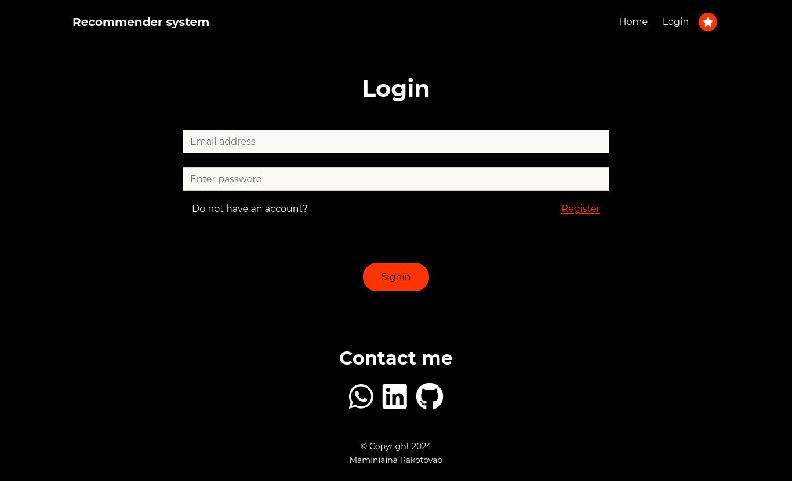
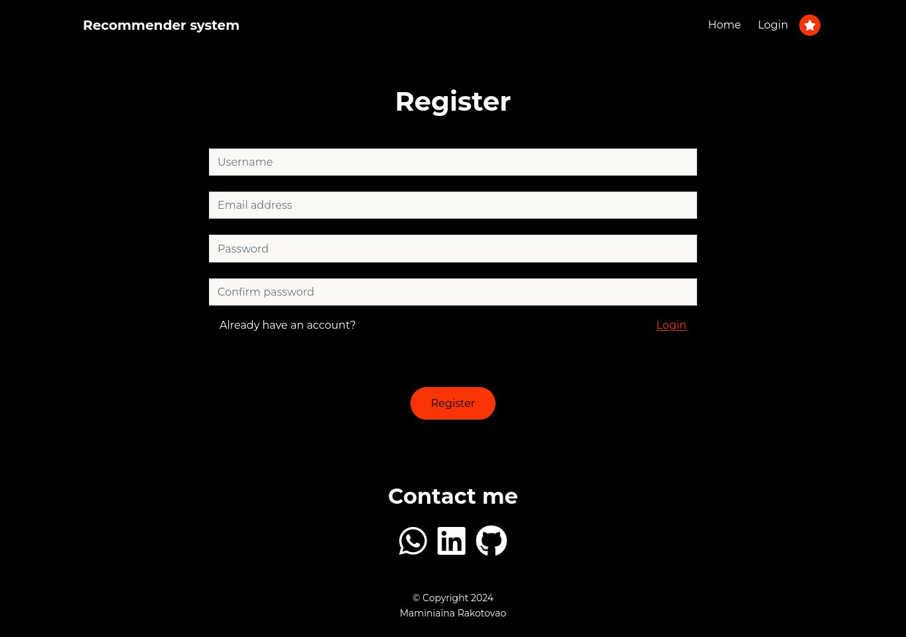
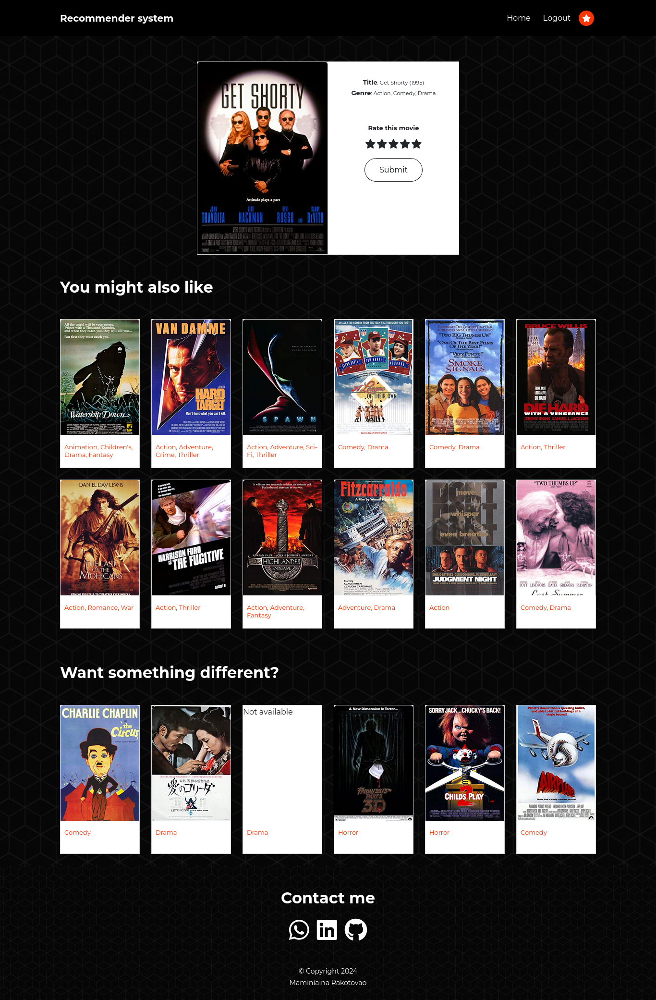
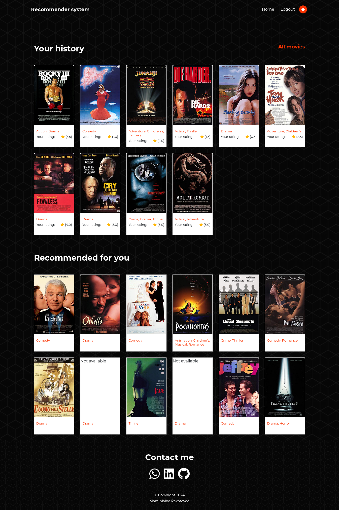

# Content based filtering
This project demonstrates the application of content-based filtering using the Alternating Least Squares (ALS) algorithm with the MovieLens small dataset. The system recommends movies based on their content characteristics, leveraging user ratings to enhance the recommendation quality.

Note: The system requires users to log in or register to view recommendations. This approach simplifies the process of generating personalized recommendations for each individual.

# Preview

PS: Contect based filtering does not account for user rating, user rating here is simply used to make the work fancy.